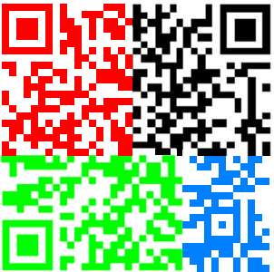

# Keith the HSCTF Site Maker

## Writeup
Looking at the about page, the logo has the URL
`/problem-static/forensics/keith_the_hsctf_site_maker/logo.jpg`, which is
suspicious. It turns out that pieces of a QR code are hidden in that logo:


### Black
Running `binwalk` on the image, we see that a second image is hidden within the
file. Extracting with `binwalk -e` gets us the first chunk.
### Red and Green
We can faintly see QR code pieces in the logo, in the bottom and in the upper
section of the "H". Ramping up the contrast and reducing brightness, we
painstakingly trace out the individual blocks.
### Blue
Running `strings` on the image gets us
```
tupper 1513937634433518429838228386256940208439666543831541569550980529254048484
79683255588841776097275826728040929574261915096275564061490770111256646122094122
14853805460632618815788313574903852812574753942476282761050415523191250543354144
55019680471164801781545843383407104762014238196256251924161829090140647929467318
52242885966049313739255621504426372801054147067162155722465753696097575106018282
65257210090557334477352338869549947374726665886775755028819901012980179631641160
79400960356563260812447652879923562486987083154513647168472741646991916003605911
07101521062628859762382724854644624653118449939993062708933378465021799778431735
71509986080886842598172755126902069843000432958884569439686480658884195545827409
444403953475040951544336640869848530076404742970159093550351910004850688
```
This is a reference to Tupper's self-referential formula, but with a twist: the
image isn't 17 pixels tall. Instead, we look at the binary representation of the
number, which should represent the bitmap image multiplied by the height of the
image. We notice big blocks of 0s and 1s, leading us to suspect that the height
of the image was just a power of 2, resulting in additional 0s tacked on at the
end. Trying various widths for the image, we get what appears to be a piece of a
QR code, with the positioning marker in the middle. 
